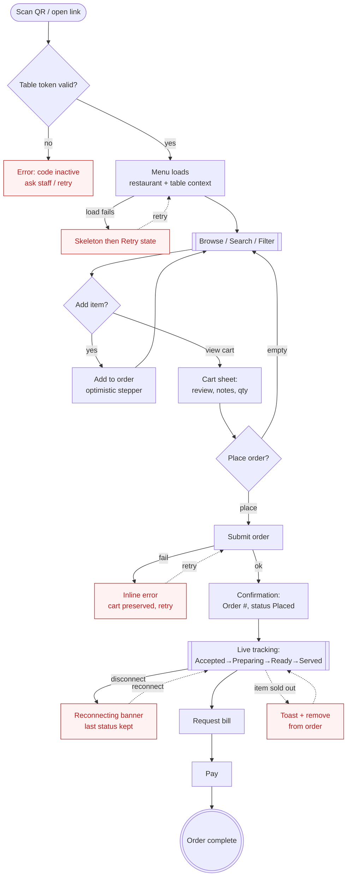
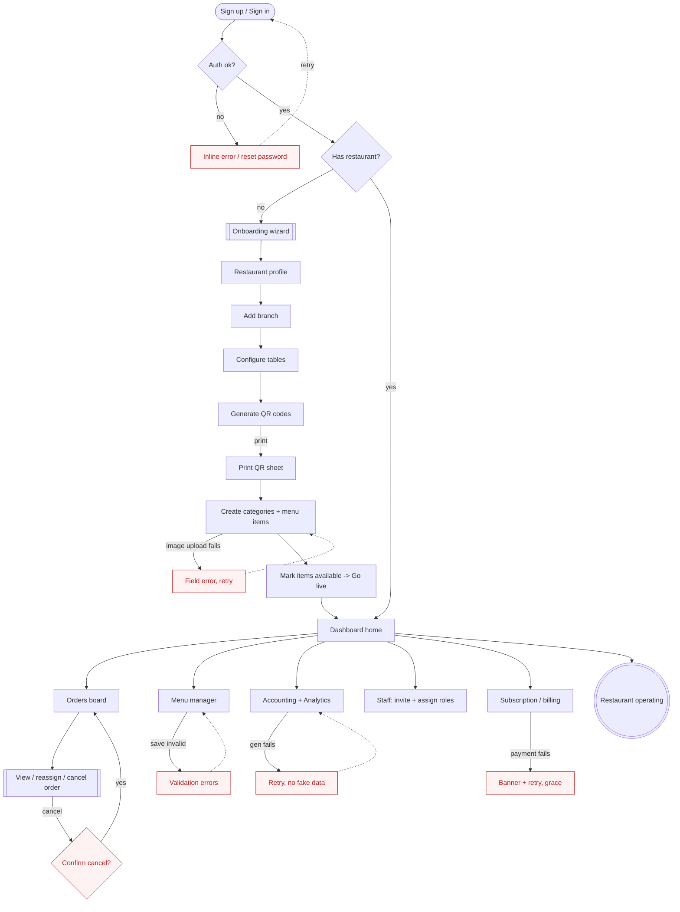
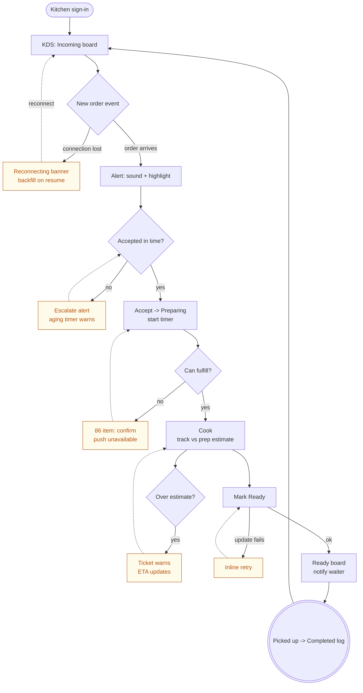
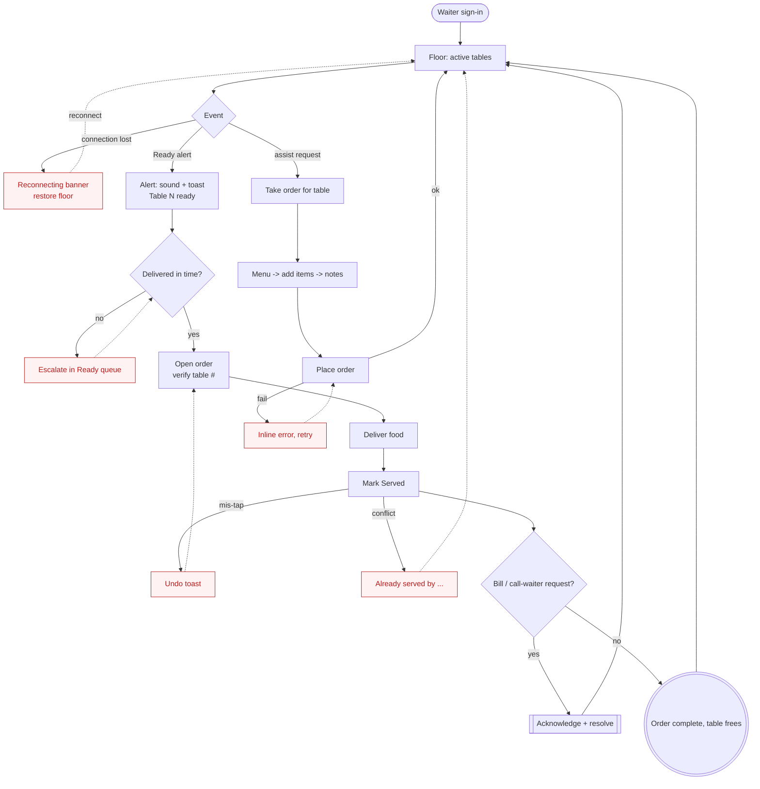
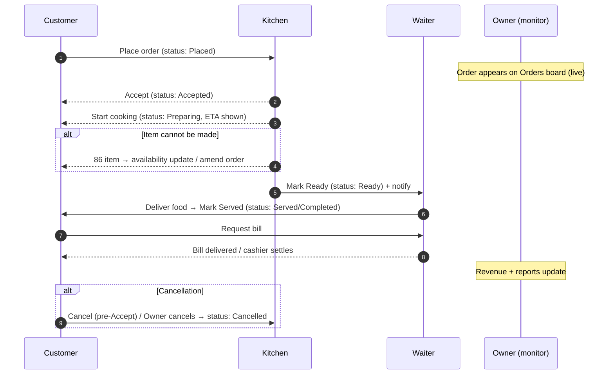

# eMenu — User Flows

**Version:** 1.0
**Status:** Foundation Release
**Last updated:** 2026-06-21
**Owner:** Product Design
**Source of truth for:** Customer App (Next.js) · Admin Dashboard (Next.js + TS)
**Companion docs:** [Requirements](./eMenuRequirementsDocument.md) · [Design System](./eMenuDesignSystem.md)

> Complete, build-ready user flows for the four operational actors: **Customer**, **Restaurant Owner**, **Kitchen Staff**, and **Waiter**. Each actor section provides: user goals, entry points, navigation structure, primary actions, success path, error path, a Mermaid flow diagram, and a screen hierarchy tree.
>
> Diagrams are written in [Mermaid](https://mermaid.js.org) — they render in GitHub, VS Code (with the Mermaid extension), and most Markdown previewers.

---

## Conventions used in this document

**Canonical order-status vocabulary** (locked, from Design System §2.5) — used identically across every actor:

`Placed` → `Accepted` → `Preparing` → `Ready` → `Served/Completed`, with `Cancelled` as a terminal off-ramp.

**Diagram legend**

| Shape / style       | Meaning                  |
| ------------------- | ------------------------ |
| `([ ])` rounded     | Start / entry point      |
| `[ ]` rectangle     | Screen or system action  |
| `{ }` diamond       | Decision                 |
| `[[ ]]` subroutine  | Sub-flow / repeated step |
| Dashed arrow `-.->` | Error / unhappy path     |
| `(( ))` circle      | Terminal success         |

**Screen-hierarchy notation:** indentation = containment; `→` = navigates to; `⤷` = modal/drawer/sheet overlay; `*` = role-gated by the Permissions Matrix (Requirements §6).

**Platform mapping**

- **Customer** → Customer App (mobile web, light-only, 480px max column).
- **Owner / Kitchen / Waiter** → Admin Dashboard (responsive; staff roles optimized for tablet, 44px+ targets).

---

## Table of Contents

1. [Customer](#1-customer)
2. [Restaurant Owner](#2-restaurant-owner)
3. [Kitchen Staff](#3-kitchen-staff)
4. [Waiter](#4-waiter)
5. [Cross-actor order lifecycle](#5-cross-actor-order-lifecycle)

---

## 1. Customer

The diner holding a phone at the table. No login, no app install — QR-scan to order in the fewest possible taps ("one-click ordering").

### 1.1 User goals

- See the menu for _this_ table's restaurant/branch instantly.
- Find and understand dishes (price, prep time, dietary tags, photos).
- Build an order and place it in one tap, with confidence it was received.
- Track the order in real time and know when food is coming.
- Settle up (request bill / pay) with no friction.

### 1.2 Entry points

| Entry point           | Context                                                               |
| --------------------- | --------------------------------------------------------------------- |
| **QR scan** (primary) | Camera → deep link `emenu.app/r/{restaurant}/t/{table}`               |
| **Direct URL**        | Shared link / typed short URL                                         |
| **"View order" link** | Returning to an in-progress order (session token in URL/localStorage) |
| **Reopen tab**        | Browser history → session resumes if order still open                 |

> No account is required to order. Optional sign-in (Google OAuth) only for order history across visits.

### 1.3 Navigation structure

```
Customer App (single-column, ≤480px, sticky CTA in thumb zone)
├── Landing / Menu  ............................. [home — auto-loaded from QR]
│   ├── Restaurant header (name, table #, branch)
│   ├── Category chip bar (scroll-spy, sticky)        → jumps to section
│   ├── Search ("Search menu")                        ⤷ results / no-results
│   ├── Menu section (repeated per category)
│   │   └── Menu Item Card (list default / grid toggle)
│   │       ⤷ Item Detail sheet (photo, desc, options, qty)
│   └── Sticky Order Bar ("View order · $42.50")      ⤷ Cart sheet
├── Cart (bottom sheet)
│   ├── Line items (edit qty / remove)
│   ├── Order notes (allergies, instructions)
│   ├── Order type (Dine-in [table prefilled])
│   └── [Place Order] (sticky, full-width xl CTA)
├── Order Confirmation  ......................... [post-place]
│   └── Order # + status badge + ETA
├── Order Tracking (live)  ...................... [primary return screen]
│   ├── Status timeline (Placed→Accepted→Preparing→Ready→Served)
│   ├── ETA / "Ready in ~8 min"
│   ├── Itemized summary
│   └── [Request bill] / [Add more items] / [Call waiter]
├── Bill / Payment
│   └── Subtotal · tax · total → pay method (per outstanding decision)
└── Account (optional, OAuth)
    └── Order history
```

### 1.4 Primary actions

- **Scan & open menu** (zero-tap to content).
- **Add to order** — one tap; quantity stepper appears in place (optimistic UI).
- **Place order** — single high-emphasis CTA in the sticky bar.
- **Track order** — passive, real-time via WebSocket; `aria-live` status announcements.
- **Request bill / Call waiter** — secondary actions from the tracking screen.

### 1.5 Success path

1. Scan QR → menu loads (table context resolved).
2. Browse / search → tap **Add** on items (cart accumulates).
3. Open cart → review, add notes → **Place Order**.
4. Receive **Order #1042 · Placed** confirmation.
5. Watch live status: Placed → Accepted → Preparing → Ready.
6. Food served → status **Served**.
7. Request bill → pay → done.

### 1.6 Error path

| Failure                      | Detection                  | Recovery (UX)                                                                               |
| ---------------------------- | -------------------------- | ------------------------------------------------------------------------------------------- |
| Invalid / expired QR         | Table token not found      | Full-page empty/error state: "This code isn't active. Ask staff for help." + retry          |
| Menu fails to load           | Fetch error / timeout      | Skeleton → error state with **Retry**; never silent spinner                                 |
| Item sold out while browsing | Realtime availability push | Card desaturates, "Sold out" badge, Add disabled; toast if it was in cart                   |
| Network drop during tracking | WebSocket disconnect       | "Reconnecting…" banner; last known status retained; auto-resume                             |
| Place Order fails            | API error                  | Inline error on CTA, cart preserved, **Try again**; no duplicate on retry (idempotency key) |
| Empty cart → Place tap       | Client validation          | CTA disabled until ≥1 item; helper text                                                     |

### 1.7 Flow diagram



---

## 2. Restaurant Owner

The operator behind the dashboard. Sets up the restaurant, owns the menu, monitors operations and money. Has the broadest permissions (Requirements §6, §12).

### 2.1 User goals

- Get a new restaurant **live**: profile → branches → tables → QR codes → menu.
- Keep the menu accurate (items, prices, availability, prep times).
- Monitor orders and revenue in real time.
- Understand the business: sales, expenses, profit, best-sellers, peak hours.
- Manage staff and their access.

### 2.2 Entry points

| Entry point           | Context                                                      |
| --------------------- | ------------------------------------------------------------ |
| **Sign up / Sign in** | Email+password or Google OAuth → JWT session                 |
| **Onboarding wizard** | First login with no restaurant → guided setup                |
| **Dashboard home**    | Returning owner → revenue/orders overview                    |
| **Deep links**        | Email/notification → specific order, report, low-stock alert |

### 2.3 Navigation structure

```
Admin Dashboard (256px left nav + content; collapses to rail→drawer)
├── Dashboard (home)  .......................... [revenue, orders, popular, expenses, profit]
├── Orders  .................................... [live monitoring]
│   ├── Tabs: All / Active / Ready / Completed / Cancelled
│   ├── Orders data table (status badge, table, total, time)
│   └── ⤷ Order detail drawer (items, timeline, reassign, cancel*)
├── Menu *  .................................... [Manage Menu permission]
│   ├── Categories (create / reorder / delete)
│   ├── Items table / grid (Menu Item Card admin variant)
│   │   ⤷ Item editor modal (name, desc, price, prep time, image, tags, available)
│   ├── Bulk import / export (CSV)
│   └── Availability toggles
├── Tables & QR  ............................... [setup + management]
│   ├── Table layout grid (per branch)
│   ├── ⤷ Table QR Card (download / print / regenerate* / deactivate)
│   └── Bulk QR sheet (print)
├── Branches  .................................. [multi-branch: Professional+]
│   └── Branch profile, hours, address
├── Accounting *  .............................. [View Reports / Manage Expenses]
│   ├── Daily sales · Monthly sales
│   ├── Expenses (categories, entries)
│   ├── Profit overview · Tax reporting
│   └── Export (PDF/CSV)
├── Analytics  ................................. [best-sellers, peak hours, trends]
├── Staff *  ................................... [Manage Staff permission]
│   ├── Staff list (role, status, branch)
│   └── ⤷ Invite / edit staff (role assignment: Waiter/Kitchen/Cashier/Manager)
├── Settings
│   ├── Restaurant profile · Tax · Currency · Discounts
│   └── Subscription & billing *  .............. [Manage Subscription — Owner only]
└── Account menu (avatar)
    └── Profile · Switch branch · Sign out
```

### 2.4 Primary actions

- **Complete onboarding** (profile → branch → tables → QR → first menu item).
- **Create / edit menu items & categories**; toggle availability; bulk import.
- **Generate / regenerate / print QR codes**.
- **Monitor & act on orders** (view, reassign, cancel).
- **Record expenses; read reports; export**.
- **Invite staff & assign roles**.
- **Manage subscription** (plan, billing).

### 2.5 Success path

1. Sign up → onboarding wizard.
2. Create restaurant profile → first branch.
3. Configure table layout → generate QR codes → print.
4. Create categories → add menu items (image, price, prep time) → mark available.
5. Go live → orders begin arriving on the Orders board.
6. Monitor revenue & active orders on Dashboard.
7. Review daily/monthly reports → record expenses → check profit.

### 2.6 Error path

| Failure                    | Detection                              | Recovery (UX)                                                                    |
| -------------------------- | -------------------------------------- | -------------------------------------------------------------------------------- |
| Sign-in fails              | Bad credentials / OAuth error          | Inline form error; "Forgot password"; retry                                      |
| Image upload fails         | S3 error / too large                   | Field error, keep form, retry; show size limit                                   |
| Save item validation       | Missing name/price                     | Inline field errors (`aria-invalid`), focus first error                          |
| Regenerate QR              | Destructive                            | Confirm modal: "Old QR codes stop working"; undo not possible → explicit confirm |
| Delete category with items | Conflict                               | Block + explain ("Move/delete N items first")                                    |
| Bulk import errors         | Row validation                         | Per-row error report, partial-success summary, downloadable error CSV            |
| Report generation fails    | Backend/timeout                        | Error state + **Retry**; never fake numbers (Principle 5)                        |
| Subscription/payment fails | Billing gateway                        | Banner + retry; grace state, no silent feature loss                              |
| Permission denied          | RBAC (e.g., Manager hits Subscription) | Permission empty state: "You don't have access"                                  |

### 2.7 Flow diagram



---

## 3. Kitchen Staff

Heads-down, high-throughput, hands-busy. Usually a tablet/screen mounted in the kitchen. Goal: see incoming orders, accept, prepare, mark ready — fast, glanceable, never miss a ticket. Permissions: View Menu, View/Update Order Status (Requirements §6).

### 3.1 User goals

- See **new incoming orders** the instant they arrive (sound/vibration).
- Accept orders and start preparation.
- Track what's cooking and in what order (oldest-first / priority).
- Mark items/orders **Ready** so waiters are notified.
- Flag items that can't be made (86 / sold out).

### 3.2 Entry points

| Entry point         | Context                                            |
| ------------------- | -------------------------------------------------- |
| **Staff sign-in**   | Kitchen account → Kitchen Display (KDS) as landing |
| **Always-on KDS**   | Mounted screen, session kept alive; auto-reconnect |
| **New-order alert** | Real-time toast + sound/vibration brings attention |

### 3.3 Navigation structure

```
Kitchen Display (KDS) — tablet-optimized, large targets, minimal chrome
├── Incoming  .................................. [Placed orders, newest highlighted]
│   └── Order ticket card (table #, items, qty, notes, timer)
│       ⤷ [Accept]  → moves to Preparing
├── Preparing  ................................. [Accepted/Preparing, oldest-first]
│   └── Order ticket (countdown vs prep-time estimate)
│       ⤷ [Mark item ready] / [Mark order Ready]
│       ⤷ [86 / Mark unavailable]  → updates menu availability
├── Ready  ..................................... [awaiting pickup by waiter]
│   └── Ticket (Ready time, "notified waiter")
├── Completed (today)  ......................... [served/cleared, read-only]
└── Bump bar / status filter (All / New / Cooking / Ready)
```

> KDS deliberately has **no** menu-editing, money, or reports surfaces — RBAC hides everything outside the kitchen's job (Principle: one decision per screen).

### 3.4 Primary actions

- **Accept** an incoming order (Placed → Accepted).
- **Start / track preparation** (Accepted → Preparing, with timer).
- **Mark Ready** (Preparing → Ready) — triggers waiter/customer notification.
- **86 an item** (mark unavailable) — propagates to customer menu instantly.
- **Acknowledge** new-order alerts.

### 3.5 Success path

1. Sign in → KDS shows Incoming.
2. New order arrives → alert (sound + visual highlight).
3. **Accept** → order moves to Preparing, timer starts.
4. Cook; **Mark Ready** when done.
5. Waiter notified → picks up → order leaves Ready.
6. Repeat; Completed log fills for the shift.

### 3.6 Error path

| Failure                                      | Detection                       | Recovery (UX)                                                                                                                       |
| -------------------------------------------- | ------------------------------- | ----------------------------------------------------------------------------------------------------------------------------------- |
| WebSocket drop (missed orders)               | Heartbeat lost                  | Prominent "Reconnecting…" banner; on reconnect, backfill + flash any missed tickets; orders also persist in list (never toast-only) |
| Alert unheard (noisy kitchen)                | Order unaccepted past threshold | Escalating visual highlight + repeat sound; aging timer turns Warning/Error color                                                   |
| Accept conflict (already accepted elsewhere) | Concurrent update               | Optimistic update reconciled; toast "Already accepted by …"; card state corrects                                                    |
| Can't fulfill item                           | Staff action                    | **86 item** → confirm → availability pushed to customers; customer carts with it are warned                                         |
| Prep time overrun                            | Timer exceeds estimate          | Ticket goes Warning then Error; ETA on customer view updates honestly                                                               |
| Status update fails                          | API error                       | Inline retry on the ticket; status not silently changed                                                                             |

### 3.7 Flow diagram



---

## 4. Waiter

Mobile/tablet on the floor. Bridges kitchen and table: assists customers, manages table orders, delivers ready food, completes/closes orders. Permissions: View Menu, **Place Order**, View/Update Order Status (Requirements §6).

### 4.1 User goals

- Know which tables are active and what each needs.
- Get notified the moment an order is **Ready** to deliver.
- Place / amend orders on behalf of customers who need help.
- Deliver food and mark orders **Served/Completed**.
- Respond to "Call waiter" / "Request bill" signals.

### 4.2 Entry points

| Entry point                  | Context                                                |
| ---------------------------- | ------------------------------------------------------ |
| **Staff sign-in**            | Waiter account → Floor view as landing                 |
| **Ready notification**       | Real-time toast + sound/vibration → jump to that order |
| **Call-waiter / bill alert** | Customer-triggered → table flagged                     |
| **Table tap**                | Scan/select a table to view or place an order          |

### 4.3 Navigation structure

```
Waiter App — mobile/tablet, large targets, alert-driven
├── Floor / Active Tables  ..................... [home]
│   ├── Table tile grid (status: free / ordering / waiting / ready / needs attention)
│   └── ⤷ Table detail (current order, status, items)
├── Orders
│   ├── Tabs: Pending / Preparing / Ready / Served
│   ├── Ready queue (priority — deliver now)
│   └── ⤷ Order detail (items, table, status timeline)
│       ⤷ [Mark Served / Complete]
├── Take order (waiter-assisted)
│   ├── Select table → menu → add items → notes
│   └── [Place Order]  (same engine as customer, on table's behalf)
├── Requests  .................................. [Call-waiter + Request-bill alerts]
│   └── ⤷ Acknowledge / resolve
└── Account (avatar) → Sign out / switch section
```

### 4.4 Primary actions

- **View active tables & their order states.**
- **Receive Ready alerts** and **deliver** food.
- **Mark order Served / Complete** (Ready → Served).
- **Place / amend an order** for a customer (assisted ordering).
- **Acknowledge & resolve** Call-waiter and Request-bill signals.

### 4.5 Success path

1. Sign in → Floor view of active tables.
2. **Ready** alert fires for Table 12 (sound + toast).
3. Open order → carry food to table → **Mark Served**.
4. Customer requests bill → request appears → notify cashier / deliver bill.
5. Order closed → table frees on the floor view.

### 4.6 Error path

| Failure                          | Detection                  | Recovery (UX)                                                                         |
| -------------------------------- | -------------------------- | ------------------------------------------------------------------------------------- |
| Missed Ready alert               | Order Ready past threshold | Escalating highlight on Ready queue + repeat alert; persists in list (not toast-only) |
| Connection drop                  | WebSocket lost             | "Reconnecting…" banner; floor state restored on resume                                |
| Wrong-table delivery risk        | —                          | Order detail prominently shows table #; confirm-on-serve for high-value/large orders  |
| Assisted order fails to place    | API error                  | Inline error, cart preserved, retry (idempotent)                                      |
| Marks Served prematurely         | Mis-tap                    | Undo toast (short window) on status change                                            |
| Duplicate handling (two waiters) | Concurrent update          | First-write wins; second sees "Already served by …" toast, state reconciles           |
| Bill request unresolved          | Aging request              | Request stays flagged until acknowledged; escalates color over time                   |

### 4.7 Flow diagram



---

## 5. Cross-actor order lifecycle

A single order is the shared object across all four actors. This swimlane shows handoffs and where each role acts on the canonical status. It is the integration contract the per-actor flows must agree with.



### Status-transition rules (who can move what)

| From → To                |    Customer    |   Waiter   |       Kitchen        | Owner/Manager |
| ------------------------ | :------------: | :--------: | :------------------: | :-----------: |
| (new) → Placed           |   ✓ (place)    | ✓ (assist) |          —           |       —       |
| Placed → Accepted        |       —        |     —      |          ✓           |       ✓       |
| Accepted → Preparing     |       —        |     —      |          ✓           |       ✓       |
| Preparing → Ready        |       —        |     —      |          ✓           |       ✓       |
| Ready → Served/Completed |       —        |     ✓      |          —           |       ✓       |
| any → Cancelled          | ✓ (pre-Accept) |     —      | ✓ (if unfulfillable) |       ✓       |

> Transitions outside this table are blocked by RBAC and surfaced as permission errors, never silent no-ops (Design System Principle 5).

---

_End of user flows — eMenu v1.0._
